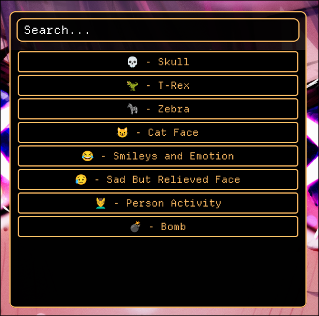

Korki is a small and simple emoji that has almost all emoji

You clone the repo and run "makepkg -si" and you are done. You can bind it in your hyprland config. The command to open it is "korki".

Credits to [emojis.wiki](https://emojis.wiki/all-emojis/) for the emojis.
